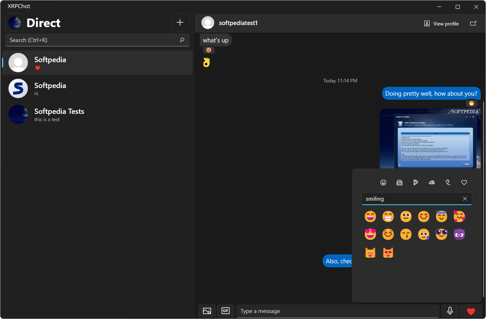

# XRPChat - Secure, Private, Decentralized Messaging

**XRPChat** is a cutting-edge, privacy-oriented messaging platform similar to **SimpleX** but with enhanced security and seamless crypto integration. Designed for individuals and organizations that value privacy, XRPChat offers a secure, decentralized, and feature-rich communication experience.

---

---

## 🚀 Features

✅ **End-to-End Encryption** – Messages are fully encrypted using state-of-the-art cryptography.

✅ **Decentralized Infrastructure** – No central servers; users communicate directly using peer-to-peer technology.

✅ **No Phone Numbers or Emails** – No personally identifiable information (PII) is required to create an account.

✅ **Self-Destructing Messages** – Configure messages to disappear after a set duration.

✅ **On-Chain Payments (XRP)** – Send XRP payments directly through the chat interface.

✅ **Open-Source & Auditable** – 100% open-source, allowing full transparency and security verification.

✅ **Multi-Platform Support** – Available on Windows, macOS, Linux, and mobile.

---

## 📦 Installation

### 🔹 Download Precompiled Build

bash
Head to releases, or [here](google.com)

### 🔹 Docker Deployment

bash
docker pull yourusername/xrpchat

---

## 📜 Usage

1. **Create a Wallet** – Generate your anonymous XRP wallet within XRPChat.
2. **Add Contacts** – Share your unique chat ID without exposing your identity.
3. **Start Chatting** – Securely exchange messages and payments with end-to-end encryption.

---

## 🌐 Roadmap

- [ ] Mobile apps for iOS & Android
- [ ] Group chats with multi-party encryption
- [ ] TOR network support for extra anonymity
- [ ] Smart contract-based escrow payments

---

## 🤝 Contributing

We welcome contributions! Feel free to fork the repository, submit pull requests, and report issues.

---

## 📄 License

This project is licensed under the MIT License. See the [LICENSE](LICENSE) file for details.

---

## ⭐ Show Your Support

If you like **XRPChat**, please ⭐ star the repo to help us grow!

---

### 🔗 Connect With Us

🌍 Website: [https://xrpchat.org](https://xrpchat.org)  
🐦 Twitter: [@XRPChat](https://twitter.com/XRPChat)  
